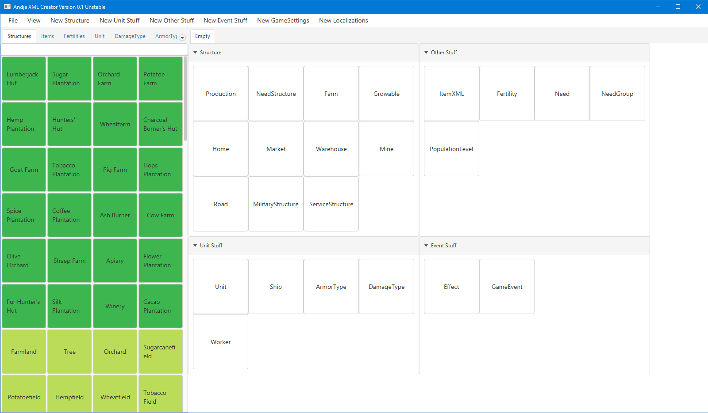

<h1 align="center">Andja XML Creator</h1>
<h3 align="center">Create and modify data in a simple interface to change values for the andja game XML-data. Programmed in Java with JavaFx as UI.</h3>
<h4 align="center">In alpha and not meant for public use.<h4>

 
 

## About The Project
Create and modify andja game data with an easy-to-use program that creates the correct XML-data for the game to use.
Data can be either a game object or a translation of UI-elements.
The program provides a simple overview of what exists in XML and it can also be shown per population level.
Also, you can set an export path and then, with a simple click, you'll have the most up-to-date data in the game.

Total Java Code Lines: 8508 (State 05.02.2022)

## Built With
 * [Java](www.java.com)
 * [JavaFX](https://openjfx.io/)
 * [SimpleXML](http://simple.sourceforge.net/)
 * [jbootx](https://github.com/dicolar/jbootx)
 
 ## Disclaimer
 * Currently not meant for public usage 